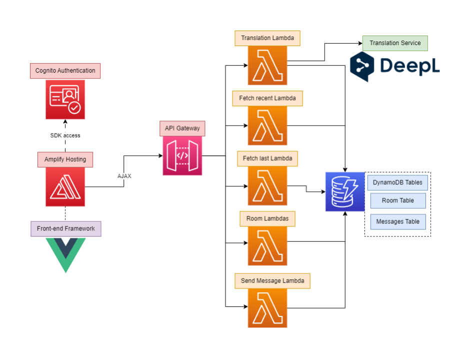

# Chat Babel 
`Authors: Jaime Gimillo Bonaque, Jakub Fołtyn, Kacper Grzymkowski`

A simple chat application which allows users to translate messages that are sent in a different language than their own. Created using exclusively serverless solutions, as a challenge. The application is somewhat inefficient and does not use proper websocket / long polling due to limitations in our cloud environment provided as part of the WUT Cloud Computing course.

Unfortunately, a live version is no longer available.

## Technologies used
* AWS Lambda
* DynamoDB
* ~AWS machine translate~
  * DeepL translation was used instead as the provided environment did not permit us access to the API
* Vue was used for the front-end of the application.
* AWS Cognito
* AWS Amplify (Hosting)

You can find more details in the [ChatBabelReport.pdf](ChatBabelReport.pdf) file. An overview diagram of the architecture can also be found below:

